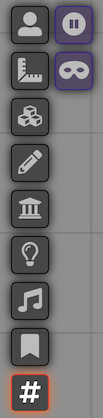

# Combat Numbers


[](https://www.patreon.com/1000nettles)

Combat Numbers is a FoundryVTT module which showcases bouncing combat text on tokens, similar to old-school JRPGs. There's still work to do, but it allows for fine-grained control on what is broadcast to other players when an actor's HP changes. 

## What Does This Look Like?

### Damage


### Healing 


Thanks to [Neutral Party](https://www.patreon.com/neutralparty) for the sample background map above.

## Supported Systems

* [DnD5e](https://foundryvtt.com/packages/dnd5e/) (Dungeons and Dragons 5th Edition)
* [D35E](https://foundryvtt.com/packages/D35E/) (3.5 SRD)
* [PF2e](https://foundryvtt.com/packages/pf2e/) (Pathfinder 2nd Edition)
* [PF1](https://foundryvtt.com/packages/pf1/) (Pathfinder 1)

If you have a system you would like to use but it is not in the list above, it may just work out of the box! If you're finding that it is not or misbehaving, read the section entitled "Advanced Customization for Unsupported Systems".

## Instructions

Install the module, enable it for your world, and voila! Any token or actor which has an HP attribute that changes will have the relevant Combat Numbers applied to them.

The manifest URL for manual installation is: https://github.com/1000nettles/combat-numbers/releases/latest/download/module.json

## Canvas Layer Controls



Combat Numbers includes an additional Canvas Layer Control button in the toolbar, seen as "#". Currently, this is only available for GMs. When clicked, you are presented with two toggleable options:

* **Pause Broadcasting:** If toggled to ON, this will pause broadcasting any Combat Number displays to other players. For example, if you modified the HP of a monster, other players would not see the Combat Numbers display on that monster token. The player can edit their own HP however and still see and broadcast their own Combat Numbers.
* **Mask Combat Numbers Display:** If toggled to ON, this will mask the numeric display of any Combat Numbers that you see and broadcast to other players. Damage Combat Numbers will be seen as "Hit", and healing Combat Numbers will be seen as "Healed". Feel free to change the text of the masked Combat Numbers in the settings.

## API

Adjust Combat Numbers settings within your macros! You can access the API via `window.combatNumbers`, and have access to these methods which affect the canvas layer controls:
* `setIsPauseBroadcast` (boolean)
* `setIsMask` (boolean)

For example, to stop broadcasting HP changes as a GM, you could run:

```javascript
window.combatNumbers.setIsPauseBroadcast(true);
```

## Settings

* **Appearance:** Customize the look and feel of the Combat Numbers when rendered on the Scene
    * **Font**
        * **Font Family:** The font that the Combat Numbers will be rendered in
        * **Font Size:** The size of the font. This renders the size of the Combat Numbers relative to the Scene's grid size
        * **Bold:** Makes the rendered text **bold**
        * **Italic:** Makes the rendered text _italicized_
    * **Fill**
        * **Damage Color:** The color used for the damage Combat Numbers
        * **Heal Color:** The color used for the healing Combat Numbers
    * **Stroke**
      * **Color:** The color used for the Combat Numbers stroke (or "outline")
      * **Thickness:** How thick the stroke (or "outline") is rendered
    * **Drop Shadow**
      * **Color:** The color used for the Combat Numbers drop shadow
      * **Alpha:** The transparency of the drop shadow. 0 is invisible, 1 is completely visible
* **Wait Time:** The amount of time (in seconds) between an HP change and displaying the Combat Numbers.
* **Linger Time:** The amount of time (in seconds) for the Combat Numbers to linger on the screen after being displayed.
* **Show Canvas Layer Controls:** If enabled, it will show the Canvas Layer Controls button in the toolbar. Defaults to enabled.  
* **Show Addition / Subtraction Modifiers:** If enabled, it will show a "-" in front of a Combat Number when dealing damage, or show a "+" when healing.
* **Masked Token Disposition Types**: The tokens that will be masked when masking is turned on, based on their disposition.
* **Mask Default State:** The default state of the masking toggle in the Canvas Layer Controls tools. Checked means ON, unchecked means OFF.
* **Mask Damage Text:** When masking is on, this is the text that will display for damage instead of the numeric value.
* **Mask Heal Text:** When masking is on, this is the text that will display for healing instead of the numeric value.
* **HP Object Path:** See the section below.
* **Temporary HP Object Path:** See the section below.

## Advanced Customization for Unsupported Systems

Currently, it's tough to support every popular system out there for Foundry. In the module settings, you can specify "HP Object Path" and "Temporary HP Object Path". Some Foundry VTT systems support HP in a slightly different object structure. If you know how Actor and Token entities structure their data for the HP and temp HP attributes, you can specify this here.

For example, the default HP Object Path for the DnD5e system is `attributes.hp.value`. For the Old-School Essentials system, it is `hp.value`.

[Please see our Wiki for details on already documented systems.](https://github.com/1000nettles/combat-numbers/wiki/Advanced-Customization-for-Unsupported-Systems)

## Language Support

* English
* 한국어/韓國語 (Korean) - thanks to `drdwing` for this localisation!
* 日本語 (Japanese) - thanks to `touge` for this localisation!
* Svenska (Swedish) - thanks to `xdy` for this localisation!

## Changelog

Please see the [Changelog](https://github.com/1000nettles/combat-numbers/blob/main/CHANGELOG.md) for all changes between updates

## Future Planned Features

* Different animations instead of just a basic bounce
* ...please suggest some!
